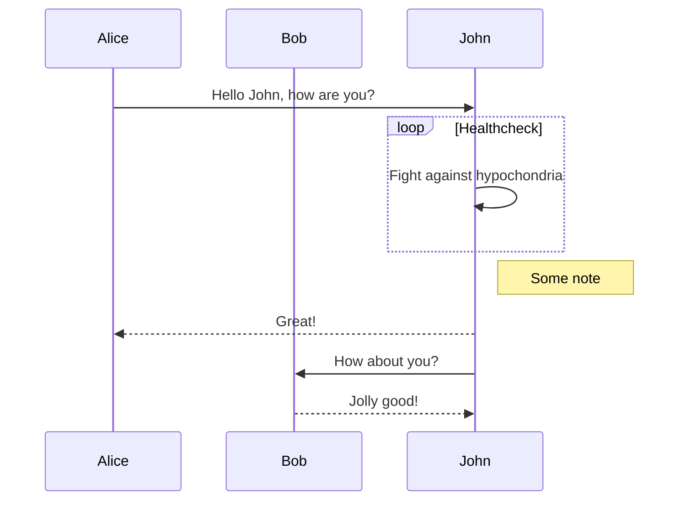
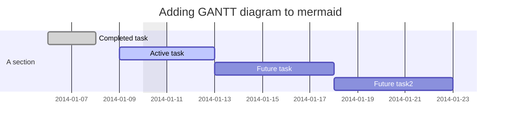
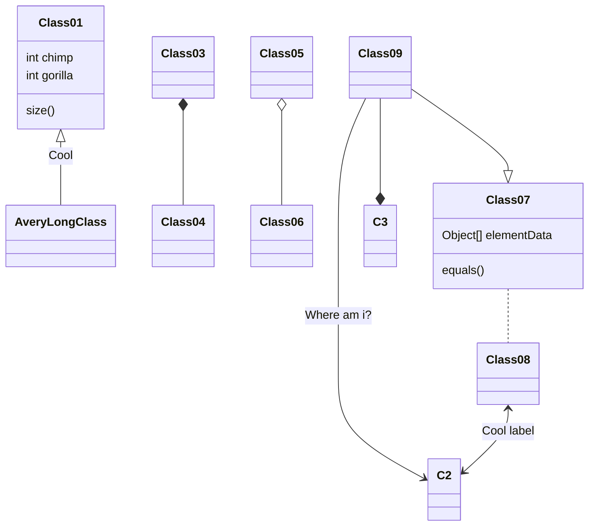
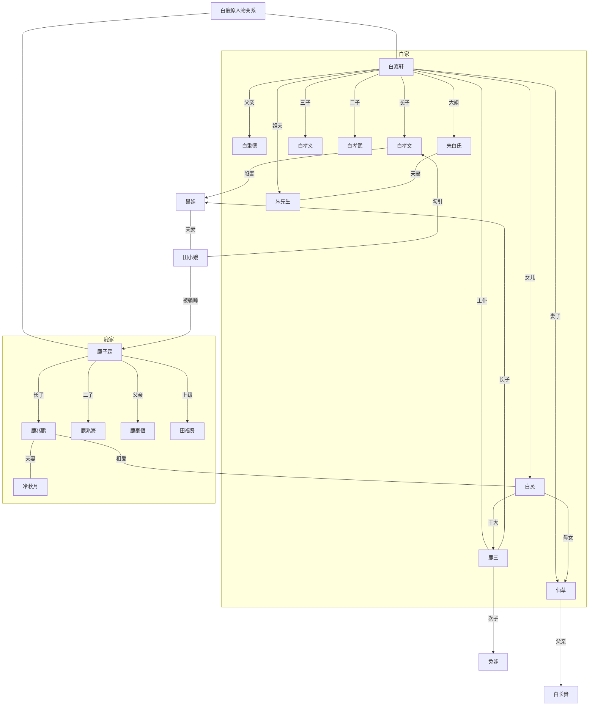
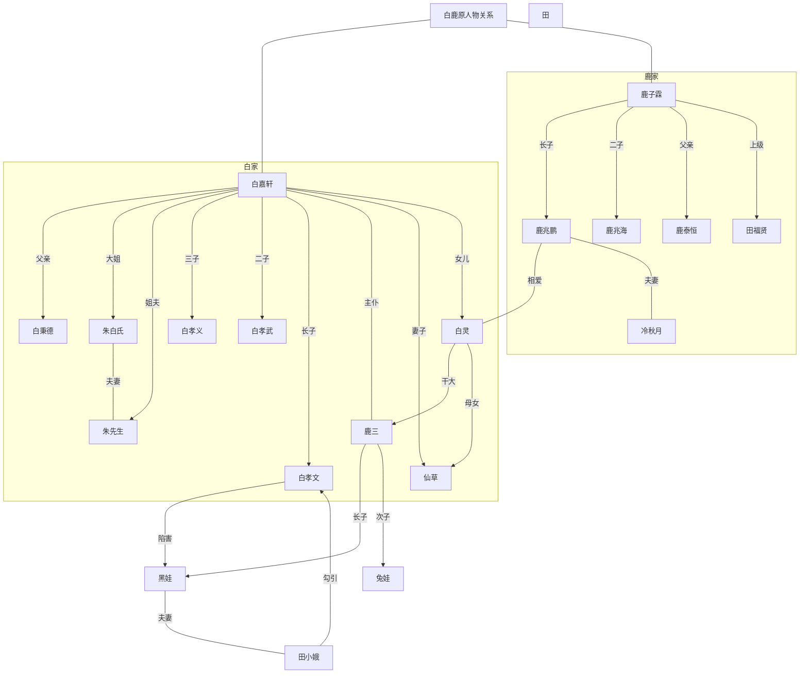

# 测试

#### 测试**测试**

**测试** *测*

**reader admin ad blod**

reader admin ad blod

_测试_

~~测试~~

# Table of Contents

- [Chapter 1](#chapter-1)
- [Chapter 2](#chapter-2)
- [Chapter 3](#chapter-3)

## Chapter 1

Content for chapter one.

## Chapter 2

Content for chapter one.

## Chapter 3 <a name="chapter-3"></a>

Content for chapter one.

![Alt text][id]

[id]: https://raw.githubusercontent.com/marktext/marktext/develop/resources/icons/256x256/marktext.png "MarkText logo"


1. Lorem ipsum dolor sit amet
  
2. Consectetur adipiscing elit
  
3. Integer molestie lorem at massa
  
4. Facilisis in pretium nisl aliquet
  
5. Nulla volutpat aliquam velit
  
6. Faucibus porta lacus fringilla vel
  
7. Aenean sit amet erat nunc
  
8. Eget porttitor lorem
  
9. asdf
  
10. asdf
  

1. asdf
  
2. sadf
  

- [x] Lorem ipsum dolor sit amet
- [x] Consectetur adipiscing elit
- [x] Integer molestie lorem at massa

- [x] [foo](#bar)
- [x] [baz](#qux)
- [x] [fez](#faz)

- [ ] 
  
  | Option | Description |
  | --- | --- |
  | data | path to data files to supply the data that will be passed into templates. |
  | engine | engine to be used for processing templates. Handlebars is the default. |
  | ext | extension to be used for dest files. |
  

| Option | Description |
| --- | --- |
| data | path to data files to supply the data that will be passed into templates. |
| engine | engine to be used for processing templates. Handlebars is the default. |
| ext | extension to be used for dest files. |

For example, to show `<div></div>` inline with other text, just wrap it in backticks.

```html
Example text here...
```

```
// Some comments
line 1 of code
line 2 of code
line 3 of code
```

```
asdfasdf
asdfa
asdfasdf
as
```

```js
grunt.initConfig({
  assemble: {
    options: {
      assets: 'docs/assets',
      data: 'src/data/*.{json,yml}',
      helpers: 'src/custom-helpers.js',
      partials: ['src/partials/**/*.{hbs,md}']
    },
    pages: {
      options: {
        layout: 'default.hbs'
      },
      files: {
        './': ['src/templates/pages/index.hbs']
      }
    }
  }
});
```

:heart: :zap: :cow: :dollar: :star: :tada:

😍

`title: YAML front matter example key: value`

Lorem ipsum dolor sit amet, graecis denique ei vel, at duo primis mandamus.

---

title: YAML front matter example
key: value

---

---

---

---

title: YAML front matter example
key: value

---

---

title: YAML front matter example
key: value

---

`title: YAML front matter example key: value`

Lorem ipsum dolor sit amet, graecis denique ei vel, at duo primis mandamus.

+++

asdf

+++

`"title": YAML front matter example "key": {   "subkey1": "value 1",   "subkey2": "value 2" }`

Lorem ipsum dolor sit amet, graecis denique ei vel, at duo primis mandamus.

{

"title": YAML front matter example
"key": {
 "subkey1": "value 1",
 "subkey2": "value 2"
}

Lorem ipsum dolor sit amet, graecis denique ei vel, at duo primis mandamus.

$$
R_x=\begin{pmatrix}
1 & 0 & 0 & 0\\
0 & cos(a) & -sin(a) & 0\\
0 & sin(a) & cos(a) & 0\\
0 & 0 & 0 & 1
\end{pmatrix}
$$

or

$$
m=\frac{b_y-a_y}{b_x-a_x}
$$

@startuml
Alice -> Bob: Authentication Request
Bob --> Alice: Authentication Response

Alice -> Bob: Another authentication Request
Alice <-- Bob: Another authentication Response
@enduml

**Visit Jon Schlinkert's GitHub Profile.**

\*this is not italic*

## Vega-lite diagram

Please see [introduction to Vega-Lite](https://vega.github.io/vega-lite/tutorials/getting_started.html) for details.

```vega-lite
{
  "data": {
    "values": [
      {"a": "C", "b": 2}, {"a": "C", "b": 7}, {"a": "C", "b": 4},
      {"a": "D", "b": 1}, {"a": "D", "b": 2}, {"a": "D", "b": 6},
      {"a": "E", "b": 8}, {"a": "E", "b": 4}, {"a": "E", "b": 7}
    ]
  },
  "mark": "point",
  "encoding": {
    "x": {"field": "a", "type": "nominal"},
    "y": {"field": "b", "type": "quantitative"}
  }
}
```

## Flowchart

```flowchart
st=>start: Start|past
e=>end: End|future
op1=>operation: My Operation|past
op2=>operation: Stuff|current
sub1=>subroutine: My Subroutine|invalid
cond=>condition: Yes
or No?|approved:>http://www.google.com
c2=>condition: Good idea|rejected
io=>inputoutput: catch something...|future
st->op1(right)->cond
cond(yes, right)->c2
cond(no)->sub1(left)->op1
c2(yes)->io->e
c2(no)->op2->e
```

## Sequence diagram

```sequence
Title: Here is a title
A->B: Normal line
B-->C: Dashed line
C->>D: Open arrow
D-->>A: Dashed open arrow
```

## Flowchart


## Sequence diagram



## Gantt diagram



## Class diagram (experimental)



$$
e=mc^2

$$

$$
m=\frac{b_y-a_y}{b_x-a_x}
$$$$
R_x=\begin{pmatrix}
1 & 0 & 0 & 0\\
0 & cos(a) & -sin(a) & 0\\
0 & sin(a) & cos(a) & 0\\
0 & 0 & 0 & 1
\end{pmatrix}


$$

:heart: :zap: :cow:

---

asdf

---

`title: YAML front matter example key: value va: asdf`

---    asdf

---

`title = "YAML front matter example" key = "value"`

Lorem ipsum dolor sit amet, graecis denique ei vel, at duo primis mandamus.

Lorem ipsum dolor sit amet, graecis denique ei vel, at duo primis mandamus.

+++

adsf

+++

+++
title = "YAML front matter example"
key = "value"
+++

+++
title = "YAML front matter example"
key = "value"
+++
Lorem ipsum dolor sit amet, graecis denique ei vel, at duo primis mandamus.

---

title: YAML front matter example
key: value

---

`title: YAML front matter example key: value`

Lorem ipsum dolor sit amet, graecis denique ei vel, at duo primis mandamus.

+++
title = "YAML front matter example"
key = "value"
+++
Lorem ipsum dolor sit amet, graecis denique ei vel, at duo primis mandamus.

`title: YAML front matter example key: value`

Lorem ipsum dolor sit amet, graecis denique ei vel, at duo primis mandamus.

---

title: YAML front matter example
key: value

---

laosdf

```vega-lite


  
    Vega-Lite Bar Chart
    

    
    
    

    
      /* Add space between Vega-Embed links  */<span class="ag-soft-line-break"></span>      .vega-actions a {<span class="ag-soft-line-break"></span>        margin-right: 5px;<span class="ag-soft-line-break"></span>      }<span class="ag-soft-line-break"></span>    
  
  
    Template for Embedding Vega-Lite Visualization
    
    

    
      // Assign the specification to a local variable vlSpec.<span class="ag-soft-line-break"></span>      var vlSpec = {<span class="ag-soft-line-break"></span>        $schema: 'https://vega.github.io/schema/vega-lite/v5.json',<span class="ag-soft-line-break"></span>        data: {<span class="ag-soft-line-break"></span>          values: [<span class="ag-soft-line-break"></span>            {a: 'C', b: 2},<span class="ag-soft-line-break"></span>            {a: 'C', b: 7},<span class="ag-soft-line-break"></span>            {a: 'C', b: 4},<span class="ag-soft-line-break"></span>            {a: 'D', b: 1},<span class="ag-soft-line-break"></span>            {a: 'D', b: 2},<span class="ag-soft-line-break"></span>            {a: 'D', b: 6},<span class="ag-soft-line-break"></span>            {a: 'E', b: 8},<span class="ag-soft-line-break"></span>            {a: 'E', b: 4},<span class="ag-soft-line-break"></span>            {a: 'E', b: 7}<span class="ag-soft-line-break"></span>          ]<span class="ag-soft-line-break"></span>        },<span class="ag-soft-line-break"></span>        mark: 'bar',<span class="ag-soft-line-break"></span>        encoding: {<span class="ag-soft-line-break"></span>          y: {field: 'a', type: 'nominal'},<span class="ag-soft-line-break"></span>          x: {<span class="ag-soft-line-break"></span>            aggregate: 'average',<span class="ag-soft-line-break"></span>            field: 'b',<span class="ag-soft-line-break"></span>            type: 'quantitative',<span class="ag-soft-line-break"></span>            axis: {<span class="ag-soft-line-break"></span>              title: 'Average of b'<span class="ag-soft-line-break"></span>            }<span class="ag-soft-line-break"></span>          }<span class="ag-soft-line-break"></span>        }<span class="ag-soft-line-break"></span>      };<span class="ag-soft-line-break"></span><span class="ag-soft-line-break"></span>      // Embed the visualization in the container with id `vis`<span class="ag-soft-line-break"></span>      vegaEmbed('#vis', vlSpec);<span class="ag-soft-line-break"></span>    
  
```

```flowchart
st=>start: Start|past
e=>end: End|future
op1=>operation: My Operation|past
op2=>operation: Stuff|current
sub1=>subroutine: My Subroutine|invalid
cond=>condition: Yes
or No?|approved:>http://www.google.com
c2=>condition: Good idea|rejected
io=>inputoutput: catch something...|future
st->op1(right)->cond
cond(yes, right)->c2
cond(no)->sub1(left)->op1
c2(yes)->io->e
c2(no)->op2->e
```

```flow

st=>start: Start|past
e=>end: End|future
op1=>operation: My Operation|past
op2=>operation: Stuff|current
sub1=>subroutine: My Subroutine|invalid
cond=>condition: Yes
or No?|approved:>http://www.google.com
c2=>condition: Good idea|rejected
io=>inputoutput: catch something...|future
st->op1(right)->cond
cond(yes, right)->c2
cond(no)->sub1(left)->op1
c2(yes)->io->e
c2(no)->op2->e

```

```flowchart

st=>start: Start|past
e=>end: End|future
op1=>operation: My Operation|past
op2=>operation: Stuff|current
sub1=>subroutine: My Subroutine|invalid
cond=>condition: Yes
or No?|approved:>http://www.google.com
c2=>condition: Good idea|rejected
io=>inputoutput: catch something...|future
st->op1(right)->cond
cond(yes, right)->c2
cond(no)->sub1(left)->op1
c2(yes)->io->e
c2(no)->op2->e
```

```flowchart

st=>start: Start|past
e=>end: End|future
op1=>operation: My Operation|past
op2=>operation: Stuff|current
sub1=>subroutine: My Subroutine|invalid
cond=>condition: Yes
or No?|approved:>http://www.google.com
c2=>condition: Good idea|rejected
io=>inputoutput: catch something...|future
st->op1(right)->cond
cond(yes, right)->c2
cond(no)->sub1(left)->op1
c2(yes)->io->e
c2(no)->op2->e
```

13graph TB
白鹿原人物关系----白嘉轩
白鹿原人物关系----鹿子霖
 subgraph 白家
 白嘉轩---->|父亲|白秉德
 白嘉轩---->|大姐|朱白氏
 白嘉轩---->|姐夫|朱先生
 白嘉轩---->|三子|白孝义
 白嘉轩---->|二子|白孝武
 白嘉轩---->|长子|白孝文
 白嘉轩----|主仆|鹿三
 白嘉轩---->|妻子|仙草
 白嘉轩---->|女儿|白灵
 end
 subgraph 鹿家
 鹿子霖---->|长子|鹿兆鹏
 鹿子霖---->|二子|鹿兆海
 鹿子霖---->|父亲|鹿泰恒
 鹿子霖---->|上级|田福贤
 鹿兆鹏----|相爱|白灵
 鹿兆鹏----|夫妻|冷秋月
 end
白灵--->|干大|鹿三
白灵---->|母女|仙草
朱白氏----|夫妻|朱先生
白孝文--->|陷害|黑娃
鹿三---->|长子|黑娃
鹿三---->|次子|兔娃
黑娃----|夫妻|田小娥
田小娥---->|勾引|白孝文
田小娥---->|被骗睡|鹿子霖
仙草---->|父亲|白长贵



```sequence
Title: Here is a title
A->B: Normal line
B-->C: Dashed line
C->>D: Open arrow
D-->>A: Dashed open arrow
```

```
Title: Here is a title
A->B: Normal line
B-->C: Dashed line
C->>D: Open arrow
D-->>A: Dashed open arrow
Title：ag
```


